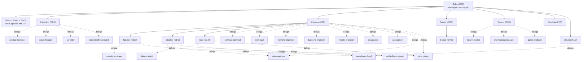

<!--
  docs/house sync
  origem: vault claudebrain / ORG.md
  path_vault: /home/petrus/IDrive/Documentos/projetos_claudebrain/ORG.md
  sync_date: 2026-08-16
  regra: se o usuário tiver o vault, o vault prevalece em conflito material; senão use esta cópia.
  sem segredos: não incluir tokens/credenciais
-->
# ORG.md — Organização tipo Bigtech no Claude

> Manual de governança da constelação de agents C-level e do roteamento de pipeline. Junta o aprendizado acumulado (agents, skills, hooks, manuais) com os artefatos `[[pipeline_release_1.0]]` e `[[lideranca_pipeline_release]]`. Estrutura o `~/.claude` como uma empresa de produto digital, dimensionável do projeto pequeno (early) à bigtech.

Hub de referência: [[Standards]]. Manuais: [[CONTRACT]], [[TESTES]], [[AGILE]], [[DEPLOY_CHECKLIST]], [[AUDITORIAS]], [[TOOLING]].

---

## 0. Autoridade Suprema (acima de toda a constelação)

**O usuário (petrus) é o líder supremo e soberano de todos os projetos desta máquina.** Títulos: Kaiser, Presidente, Rei, Soberano, CIO, CEO, e **Chief Medical Officer** em qualquer liderança/decisão de domínio médico.

A constelação C-level (Celso/CEO inclusive) propõe e executa, mas **a palavra final é do usuário**. Decisões de altíssimo valor (arquitetura macro, escopo, stack, go/no-go, deploy irreversível, gasto, qualquer escolha difícil de reverter, e toda decisão médica/clínica) são SEMPRE dele. Ele lidera os times quando há dúvida ou mais de uma opção.

Regra operacional: diante de dúvida ou de mais de uma opção viável, **perguntar via AskUserQuestion** (opção recomendada primeiro), nunca decidir sozinho. Decisão trivial e reversível com default óbvio segue o default e informa. Detalhe em [[user-lider-supremo]] (memória global) e na "Regra de design 2026-05-27" do CLAUDE.md global.

---

## 1. Visão

O pipeline de release (12 fases) cruza três domínios: o quê construir, como construir, como vender. Cada domínio tem um C-level. Para operar isso no Claude, cada C-level vira um **agent orquestrador leve**: ele decide e devolve um mapa de delegação; os **agents operacionais** (já existentes) executam. Um **Chief of Staff** (Cósimo) classifica o porte do projeto e ativa só o necessário, prevenindo over-engineering.

Princípio anti-OE: **o processo se adapta ao porte, nunca o contrário.** Quem decide o porte e a variante de pipeline é o Cósimo (Chief of Staff). Ver secao 5.

---

## 2. A constelação C-level (nome próprio + cargo)

Naming: o nome embute a sigla do cargo, na ordem. Invocação como agent pelo slug `nome-cargo`.

| Agent | Cargo | Sigla no nome | Domínio | Fases | Delega para (operacionais) |
|---|---|---|---|---|---|
| **Celso** | CEO | **C**els**O** | Estratégia, arbitragem | 0, 11 (coord.) | os outros C-levels |
| **Capitolino** | CPO | **C**a**P**itolin**O** | Produto, design | 0-3, 12 | product-manager, ux-researcher, business-analyst, ux-ui-designer, ux-writer, accessibility-specialist, art-director |
| **Caetano** | CTO | **C**ae**T**an**O** | Engenharia do produto | 4-9 | software-architect, tech-lead, frontend/backend/mobile-engineer, devops-sre, network-engineer, qa-engineer, performance-engineer, data-engineer, ml-engineer |
| **Camilo** | CMO | **C**a**M**il**O** | Marketing, GTM | 10, parte 11 | product-marketing-manager, growth-engineer, content-seo, pr-comms, community-manager |
| **Cosmo** | COO | **C**Osm**O** | Execução cross-func | 6-11 | scrum-master, engineering-manager, game-producer, engineering-coach, customer-success, support-engineer, release-manager |
| **Narciso** | CISO | nar**CISO** | Segurança | 8 (e by design na 4) | security-engineer, network-security-engineer, compliance-legal |
| **Cândido** | CDO | **C**an**D**id**O** | Dados, analytics, ML | 2 (instr.), 6-12 | data-engineer, data-scientist, ml-engineer |
| **Caio** | CAIO | **CAIO** (nome = sigla) | IA como capability (modelo, governança, responsible AI, frota de agents) | 2, 4, 6-8, 12 (quando IA é capability) | applied-ai-engineer, ml-engineer (compart. com CDO) |
| **Confúcio** | CFO | **C**on**F**úci**O** | Finanças, orçamento | transversal, 10 | economy-designer (jogo), devops-sre (custo infra) |
| **Cícero** | CRO | **C**íce**RO** | Receita, vendas | 10-11 | revenue-ops |
| **Cláudio** | CLO | **CL**audi**O** | Jurídico, General Counsel | 8 | compliance-legal, internal-auditor (compartilhado com Narciso/CISO e Caetano/CTO) |
| **Cósimo** | Chief of Staff | **C**ó**S**im**O** | Roteamento de pipeline, anti-OE | todas (meta) | classifica porte e ativa os demais |

CHRO fica mapeado por ora a `engineering-manager` + `engineering-coach` (pessoas). Promover a C-level só se a organização crescer (decisão de Cósimo). Ver pendências ORG-08.

---

## 3. Organograma

---

## 4. RACI fase x C-level

R = Responsável (faz acontecer), A = Aprovador (decide), C = Consultado, I = Informado.

| Fase | Celso CEO | Capitolino CPO | Caetano CTO | Camilo CMO | Cosmo COO | Narciso CISO | Cláudio CLO |
|---|---|---|---|---|---|---|---|
| 0. Ideação | A/R | C | I | I | I | - | - |
| 1. Discovery | A | R | C | C | I | - | - |
| 2. Definição | A | R | C | I | I | I | I |
| 3. Design | I | A/R | C | C | I | - | - |
| 4. Arquitetura | I | C | A/R | - | I | C | I |
| 5. Setup Eng | I | - | A/R | - | C | C | - |
| 6. Desenvolvimento | I | C | A/R | I | R | I | - |
| 7. QA | I | C | A/R | - | C | C | - |
| 8. Segurança/Compliance | A | I | C | I | I | A/R | A/R |
| 9. Beta | A | R | R | C | R | C | I |
| 10. GTM | A | C | I | A/R | R | I | C |
| 11. Release 1.0 | A/R | C | R | R | R | C | I |
| 12. Pós | A | A/R | C | C | R | I | I |

Cândido (CDO), Caio (CAIO), Confúcio (CFO) e Cícero (CRO) entram conforme o produto: dados como ativo, IA como capability, modelo comercial, receita B2B. Cósimo define quando. Fronteira CDO↔CAIO: o CDO governa o **dado** (pipeline, qualidade, privacidade, analytics); o CAIO governa o **modelo e o uso de IA** (estratégia, governança, responsible AI, frota de agents).

---

## 5. Variantes de pipeline por porte (anti over-engineering)

Quem decide e re-avalia: **Cósimo (Chief of Staff)**. Critérios em `[[lideranca_pipeline_release]]` secao 5 e no próprio agent.

| Variante | Porte | C-levels ativos | Cerimônia | Fases |
|---|---|---|---|---|
| **Pipeline-Sprint** | early minimalista / projeto pequeno | Celso, Caetano | nenhuma | colapsadas |
| **Pipeline-Lean** | early (2-20) | + Capitolino, Camilo (light), Narciso (se dado sensível) | Kanban / Shape Up | leves |
| **Pipeline-Padrão** | scale-up (50-500) | + Cosmo; constelação núcleo | Scrum/Kanban formal | 12 completas |
| **Pipeline-Completo** | bigtech (500+) | + Cândido, Caio (se IA é capability), Confúcio, Cícero, Cláudio | formal multi-time | ramificado por produto |

> **NUNCA classificar como solo:** a constelacao cobre os papeis; o headcount humano (1) nao rebaixa o porte. Piso = early. Dimensione por complexidade/criticidade/escala (anti-OE por necessidade real, nao por escassez de gente).

Regra de criticidade: projeto pequeno mas crítico (saúde, dinheiro, PII) sobe de faixa em segurança (Narciso) e jurídico (Cláudio) em qualquer porte. Regra de IA: **IA como capability central** (o produto é IA ou depende dela como diferencial) ativa Caio (CAIO) + `applied-ai-engineer` em qualquer porte; uma integração Claude pontual NÃO acorda o CAIO (usa só a skill `claude-api` + `applied-ai-engineer`). Cósimo re-avalia a cada marco e registra transições no [[Journal]]/eventos.

---

## 6. Tabela de pendências (canônica)

Status: ✅ Concluído · 🔄 Em andamento · 🟡 Parcial · ⏳ Pendente · 💡 Decisão tomada · 🎨 Pendente design · 🔍 Pendente verificação.

| ID | Grupo | Descrição Técnica | Prioridade | Pré-requisito | Dificuldade | Status | Estado Auditado |
| :--- | :--- | :--- | :--- | :--- | :--- | :--- | :--- |
| ORG-01 | AGENTS-C | Criar 11 agents C-level + Chief of Staff em `~/.claude/agents/` (celso-ceo, capitolino-cpo, caetano-cto, camilo-cmo, cosmo-coo, narciso-ciso, candido-cdo, confucio-cfo, cicero-cro, claudio-clo, cosimo-chief-of-staff) | Alta | — | Média | ✅ Concluído | — |
| ORG-02 | AGENTS-OP | Criar agents operacionais de MARKETING (lacuna total da Fase 10): `product-marketing-manager`, `growth-engineer`, `content-seo`, `pr-comms`, `community-manager`. Camilo (CMO) delega a eles | Alta | ORG-01 | Alta | ✅ Concluído | ✓ |
| ORG-03 | AGENTS-OP | Criar agent de RECEITA/vendas (`revenue-ops`) para Cícero (CRO) delegar em contexto B2B | Média | ORG-01 | Média | ✅ Concluído | ✓ |
| ORG-04 | AGENTS-OP | Criar agent `customer-success` + `support-engineer` (Fases 9 e 12, hoje sem cobertura) | Média | — | Média | ✅ Concluído | ✓ |
| ORG-05 | AGENTS-OP | Criar agent `release-manager` (Fase 11, coordenação de execução do lançamento) | Média | ORG-01 | Baixa | ✅ Concluído | ✓ |
| ORG-06 | AGENTS-OP | Separar `ux-researcher` de `ux-ui-designer` (pesquisa qualitativa/quantitativa dedicada) | Baixa | — | Média | ✅ Concluído | ✓ |
| ORG-07 | AGENTS-OP | Criar `business-analyst` e `performance-engineer` dedicados (antes parcialmente cobertos por product-manager e qa-engineer) | Baixa | — | Média | ✅ Concluído | ✓ |
| ORG-08 | AGENTS-C | Decidir promover CHRO a C-level próprio ou manter mapeado a engineering-manager + engineering-coach | Baixa | — | Baixa | 💡 Decisão tomada | — |
| ORG-09 | DOC | Reescrita profunda de `[[pipeline_release_1.0]]` (mermaid, coluna Agent/C-level por fase, variantes por porte, wikilinks, remover em-dash) | Alta | ORG-01 | Média | ✅ Concluído | ✓ |
| ORG-10 | DOC | Reescrita profunda de `[[lideranca_pipeline_release]]` (constelação nomeada, RACI, organograma mermaid, wikilinks) | Alta | ORG-01 | Média | ✅ Concluído | ✓ |
| ORG-11 | DOC | Criar este `ORG.md` (constelação + RACI + variantes + pendências) e ligar ao hub | Alta | ORG-01 | Média | ✅ Concluído | — |
| ORG-12 | PROCESSO | Integrar ORG no hub `[[Standards]]` e ponteiro no `[[TODO]]` do vault | Alta | ORG-11 | Baixa | ✅ Concluído | ✓ |
| ORG-13 | SKILL | Criar skill orquestradora `/bigtech` que invoca Cósimo, classifica porte e devolve o mapa de ativação de agents. Camada de negócio; delega engenharia ao `/proj_software` (DRY) | Média | ORG-01 | Alta | ✅ Concluído | ✓ |
| ORG-14 | PROCESSO | Registrar a decisão de arquitetura em memória global tipada + ponteiros MEMORY.md (global e local do projeto) | Alta | ORG-01 | Baixa | ✅ Concluído | ✓ |
| ORG-15 | PROCESSO | Gatilho para classificar porte ao iniciar projeto: hook SessionStart `bigtech_porte_reminder.py` (lembra de rodar `/bigtech` em projeto de código sem marcador `.bigtech-porte`; silencia após classificar) | Baixa | ORG-13 | Média | ✅ Concluído | ✓ |
| ORG-16 | AGENTS-OP | Criar agent `internal-auditor` (dono do DOSSIÊ DE AUDITORIA completo, "o livro" do projeto, ex: `docs/auditoria/` do site). Orquestra os especialistas por capítulo do `[[AUDITORIAS]]`, consolida o livro, rastreia remediação, entrega ao auditor externo. Reporta a Cláudio (CLO) + Narciso (CISO) + Caetano (CTO). Hoje só parcialmente coberto por technical-writer (monta doc, sem mandato de auditoria) | Média | ORG-01 | Média | ✅ Concluído | ✓ |
| ORG-17 | PROCESSO | Definir e aplicar a política de ferramentas dos agents (secao 8): Read sempre; Grep/Glob sempre; Write/Edit para quem produz ou mantém artefato; Bash para quem executa; read-only documentado como exceção. Auditados os 61 agents | Alta | ORG-01 | Baixa | ✅ Concluído | ✓ |
| ORG-18 | AGENTS-OP | Criar agent `network-engineer` (camada de rede: topologia, roteamento BGP/OSPF, VLAN, subnet/IPAM, NAT, DNS/DHCP, load balancing, VPN, SD-WAN, cloud networking VPC/peering). Sob Caetano (CTO), colabora com devops-sre. Distinto de network-security-engineer | Média | ORG-01 | Média | ✅ Concluído | ✓ |
| ORG-19 | AGENTS-OP | Criar agent `network-security-engineer` (defesa de rede: firewall policy, segmentação/microssegmentação, zero-trust/ZTNA, IDS/IPS, WAF, DDoS, NAC, mTLS, east-west, IR de rede). Sob Narciso (CISO), compartilha com security-engineer (AppSec). Distinto de network-engineer | Média | ORG-01 | Média | ✅ Concluído | ✓ |
| ORG-20 | TOOLING | Criar manual `[[TOOLING]]` (catálogo de ferramentas FOSS automatizáveis tool->agent->status->instalar, kit canônico por agent) e linkar seção "Ferramentas (usar SEMPRE)" nos 20 agents operacionais-chave. Survey do sistema feito; faltantes documentados com comando de instalar | Média | ORG-01 | Média | ✅ Concluído | ✓ |

---

## 7. O que já existe vs o que falta (resumo)

**Já existe (cobre o pipeline):** product-manager, software-architect, tech-lead, frontend/backend/mobile-engineer, devops-sre, qa-engineer, security-engineer, data-engineer, data-scientist, ml-engineer, ux-ui-designer, ux-writer, accessibility-specialist, compliance-legal, technical-writer, engineering-manager, engineering-coach, scrum-master, game-producer. Skills: proj_software, proj_jogo, create-adr, create-rfc, security-threat-model, tab_pendencias, decomposition-planning-roadmap. Hooks: no_mdash, trash-guard. Manuais: os 5 canônicos.

**Criado agora:** a constelação C-level (secao 2).

**Tabela zerada.** Tudo concluído: constelação C-level (12, incluindo Caio/CAIO add. 2026-05-30), agents operacionais do pipeline inteiro (incluindo ux-researcher, business-analyst, performance-engineer, internal-auditor, applied-ai-engineer), skill `/bigtech` e hook de classificação de porte (SessionStart). A organização está completa, operacional, disparável por comando e com gatilho de onboarding. Única decisão em aberto não-bloqueante: ORG-08 (CHRO mapeado a engineering-manager/coach, sem agent C dedicado por ora).

---

## 8. Política de ferramentas dos agents

Regra para definir o campo `tools:` de qualquer agent (existente ou novo). Auditada nos 61 agents em 2026-05-28.

| Ferramenta | Quem recebe |
|---|---|
| **Read** | **Todos, sempre.** Sem exceção. |
| **Grep, Glob** | Todos, sempre (navegação e busca). |
| **Write** | Quem **produz artefato** (doc, PRD, ADR, spec, relatório, código, config). |
| **Edit** | Quem **mantém/revisa artefato existente** in-place (itera PRD, emenda ORG, corrige ToS, edita código). |
| **Bash** | Quem **executa** (engenharia, devops, performance, diagnóstico, auditoria, qa). |
| **WebFetch, WebSearch** | Quem **pesquisa fonte externa** (a maioria). |
| **TodoWrite** | Quem **planeja tarefa multi-passo**. |

**Exceções read-only (documentadas, não são bug):**
- `linux-diag`: contrato de diagnóstico read-only (NUNCA corrige/instala/edita). Sem Write, sem Edit.
- `revisor-textual`: revisa e corrige texto existente (tem Edit, modo apply-fixes opt-in); não cria arquivo, então sem Write.

**Resultado da auditoria:** Read 61/61, Write 59/61, Edit 60/61. Todo agent que produz ou mantém artefato tem Read+Write+Edit; só as 2 exceções acima ficam de fora, por design. Ao criar agent novo, seguir esta tabela.

---

## 9. Links

- [[Standards]] · [[CLAUDE]] · [[TODO]]
- [[pipeline_release_1.0]] · [[lideranca_pipeline_release]]
- [[CONTRACT]] · [[TESTES]] · [[AGILE]] · [[DEPLOY_CHECKLIST]] · [[AUDITORIAS]] · [[TOOLING]]
- [[Projects]] · [[Areas]] · [[Resources]]
