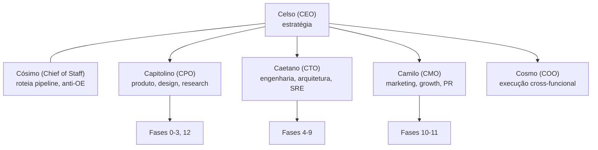

# Quem Lidera o Pipeline de Release? Mapa de C-Levels e a Constelação de Agents

> Resposta curta: **nenhum C-level único lidera o pipeline inteiro**. O CEO coordena estrategicamente; CPO, CTO e CMO lideram operacionalmente cada grande bloco. CIO **não é** o papel correto para produto digital. Este documento mapeia a teoria de liderança e a sua materialização na constelação de agents do Claude.

Pipeline detalhado: [pipeline_release_1.0](pipeline_release_1.0.md). Governança e pendências: [ORG](ORG.md).

---

## 1. A divisão clássica em empresas maduras

O pipeline cruza três domínios: o quê construir, como construir, como vender. Cada um tem seu C-level historicamente separado.

### 1.1. Os três pilares operacionais

| C-Level | Agent | Pergunta que responde | Fases que lidera | Times sob comando |
|---|---|---|---|---|
| **CPO** | Capitolino | O quê e por quê construir? | 0, 1, 2, 3, 12 | PMs, Designers, UX Research |
| **CTO** | Caetano | Como construir tecnicamente? | 4, 5, 6, 7, 8, 9 | Engenharia, Arquitetura, SRE, Segurança |
| **CMO** | Camilo | Como vender e comunicar? | 10, parte de 11 | Marketing, Growth, PR, Conteúdo |

### 1.2. O coordenador

| C-Level | Agent | Função |
|---|---|---|
| **CEO** | Celso | Alinha os três pilares numa direção única, arbitra trade-offs, responde ao board |

O CEO lidera o pipeline inteiro como **coordenador estratégico**, não como executor operacional de cada fase.

---

## 2. Organograma da constelação

**Alternativa textual do organograma** (equivalente ao diagrama acima): no topo está **Celso (CEO)**, com **Cósimo (Chief of Staff)** ao lado como par de roteamento. O CEO supervisiona os quatro pilares operacionais: **Capitolino (CPO)**, **Caetano (CTO)**, **Camilo (CMO)** e **Cosmo (COO)**. Cada pilar lidera um bloco de fases: o CPO toca as fases 0 a 3 e a 12; o CTO toca as fases 4 a 9; o CMO toca as fases 10 e 11.

C-levels complementares (Narciso/CISO, Cândido/CDO, Confúcio/CFO, Cícero/CRO, Cláudio/CLO) entram conforme o porte e o tipo de produto. Mapa completo em [ORG](ORG.md) seção 2.

---

## 3. Por que o CIO não lidera produto digital

A confusão entre CTO e CIO é frequente porque ambos lidam com tecnologia. A régua que os separa é o **cliente**.

| Papel | Foco | Cliente | Exemplo |
|---|---|---|---|
| **CTO** (Caetano) | Produto que a empresa **vende** | Usuário final externo | Arquitetura do SaaS, app mobile, API pública |
| **CIO** | Sistemas que a empresa **usa** | Funcionário interno | ERP, CRM, e-mail corporativo, VPN, helpdesk |

### Onde o CIO é central
Indústria tradicional, varejo, bancos, seguradoras, governo: tecnologia **suporta** o negócio mas não **é** o negócio.

### Onde o CIO é periférico ou inexistente
SaaS, startups de produto digital, app companies: o CTO domina; o CIO, se existir, é figura administrativa.

**Conclusão:** para um pipeline de release de aplicativo, **CTO** (Caetano) é a liderança técnica certa. **CIO** é a resposta errada. Por isso não há agent CIO na constelação.

---

## 4. C-Levels complementares no pipeline

| C-Level | Agent | Significado | Onde entra |
|---|---|---|---|
| **COO** | Cosmo | Chief Operating Officer | Execução cross-funcional, Fases 6 a 11 |
| **CISO** | Narciso | Chief Information Security Officer | Fase 8; reporta a Caetano ou Celso |
| **CDO** | Cândido | Chief Data Officer | Dados como ativo (analytics, ML); governança |
| **CFO** | Confúcio | Chief Financial Officer | Orçamento de cada fase, pricing (Fase 10) |
| **CRO** | Cícero | Chief Revenue Officer | SaaS B2B: vendas + parte do GTM |
| **CLO** | Cláudio | Chief Legal Officer / General Counsel | Documentos legais, LGPD, contratos (Fase 8) |
| **Chief of Staff** | Cósimo | Roteador de pipeline | Classifica porte, ativa o time, anti-OE |

Em estruturas grandes, VPs ficam abaixo dos C-levels (VP de Engenharia sob CTO, VP de Produto sob CPO, etc.).

---

## 5. Configurações reais por estágio (porte do projeto)

Quem aplica isso na prática é **Cósimo (Chief of Staff)**, selecionando a variante de pipeline. Ver [ORG](ORG.md) seção 5 e [pipeline_release_1.0](pipeline_release_1.0.md) seção final.

### 5.1. Solo founder / projeto pessoal (1 pessoa) -> Pipeline-Sprint
Uma pessoa acumula tudo: CEO + CPO + CTO + CISO + CMO. Comum em fundador técnico-domínio (médico-dev, advogado-dev). O pipeline é o mesmo, executado em série e enxuto. Agents ativos: Celso e Caetano; o resto dormente (salvo criticidade: dado de saúde mantém Narciso e Cláudio).

### 5.2. Early-stage startup (2 a 20 pessoas) -> Pipeline-Lean
- **a) Fundador único técnico**: CEO + CTO na mesma pessoa; primeira contratação sênior costuma ser PM ou Marketing.
- **b) Dupla fundadora (mais comum)**: CEO toca produto/mercado/negócio, CTO toca engenharia/infra. Funciona até ~50 pessoas.
- **c) Trio fundador**: CEO + CTO + (CPO ou CMO). Robusto quando os três domínios são igualmente críticos.

### 5.3. Scale-up (50 a 500 pessoas) -> Pipeline-Padrão
CEO + CPO + CTO + CMO consolidados. COO entra quando a operação cross-funcional fica complexa. CISO surge com preocupação regulatória.

### 5.4. Big tech / enterprise (500+ pessoas) -> Pipeline-Completo
Constelação inteira: CEO, COO, CFO, CTO, CPO, CMO, CISO, CDO, CHRO, CLO. Cada um com VPs e diretores. Pipeline ramificado em múltiplos produtos, cada um com seu PM e Eng Manager.

---

## 6. RACI: quem responde por cada fase

R = Responsável, A = Aprovador, C = Consultado, I = Informado. Matriz completa em [ORG](ORG.md) seção 4.

| Fase | Responsável principal | Apoio |
|---|---|---|
| 0. Ideação | Celso (CEO) | Capitolino (CPO) |
| 1. Discovery | Capitolino (CPO) | Celso, Camilo |
| 2. Definição | Capitolino (CPO) | Caetano (viabilidade) |
| 3. Design | Capitolino (CPO) | — |
| 4. Arquitetura | Caetano (CTO) | Narciso (CISO) |
| 5. Setup Eng | Caetano (CTO) | — |
| 6. Desenvolvimento | Caetano (CTO) | Capitolino (priorização), Cosmo (COO) |
| 7. QA | Caetano (CTO) | — |
| 8. Segurança/Compliance | Narciso (CISO) / Cláudio (CLO) | General Counsel, DPO |
| 9. Beta | Capitolino + Caetano | Customer Success |
| 10. GTM | Camilo (CMO) | Capitolino, Celso, Cícero (CRO) |
| 11. Release 1.0 | Celso coordena, Caetano + Camilo executam | Todos |
| 12. Pós | Capitolino (CPO) | Caetano (estabilidade), Camilo (crescimento) |

---

## 7. Anti-padrões de liderança

1. **CIO confundido com CTO** em empresa de produto.
2. **CTO sem CPO**: engenharia constrói coisas corretas que ninguém quer.
3. **CPO sem CTO**: produto bem desenhado mas inviável.
4. **CEO acumulando tudo** em empresa grande: vira gargalo de decisão.
5. **CMO entrando tarde demais**: produto pronto sem narrativa, lançamento morre.
6. **Founder técnico recusando contratar CMO**: "se o produto é bom, se vende sozinho". Não se vende.
7. **CISO subordinado demais**: segurança virando checkbox leva a vazamento.
8. **Over-engineering de liderança**: nomear 10 C-levels para um projeto solo. Cósimo previne.

---

## 8. Resumo executivo

> A pergunta "quem lidera o pipeline?" tem três respostas em camadas:
>
> 1. **Estrategicamente**: Celso (CEO), que alinha produto, tecnologia e mercado.
> 2. **Operacionalmente**: o trio Capitolino (CPO), Caetano (CTO), Camilo (CMO), cada um liderando seu bloco de fases.
> 3. **Em solo founder ou early-stage**: uma pessoa acumula múltiplas cadeiras; o que muda é onde delegar primeiro quando crescer, decidido por Cósimo (Chief of Staff).
>
> **CIO não é a resposta** para produto digital: cuida de TI corporativa interna, não do produto vendido.

---

## Anexo: glossário de siglas C-level

| Sigla | Significado | Agent | Domínio |
|---|---|---|---|
| CEO | Chief Executive Officer | Celso | Estratégia geral, board |
| COO | Chief Operating Officer | Cosmo | Operação cross-funcional |
| CFO | Chief Financial Officer | Confúcio | Finanças |
| CTO | Chief Technology Officer | Caetano | Tecnologia do produto |
| CIO | Chief Information Officer | (sem agent) | TI corporativa interna |
| CPO | Chief Product Officer | Capitolino | Produto e UX |
| CMO | Chief Marketing Officer | Camilo | Marketing e GTM |
| CRO | Chief Revenue Officer | Cícero | Receita e vendas |
| CISO | Chief Information Security Officer | Narciso | Segurança |
| CDO | Chief Data Officer | Cândido | Dados e analytics |
| CLO | Chief Legal Officer | Cláudio | Jurídico |
| Chief of Staff | Roteador de pipeline | Cósimo | Anti-OE, ativação de time |
| CHRO | Chief Human Resources Officer | (engineering-manager) | RH |

---

## Links

- [ORG](ORG.md) · [pipeline_release_1.0](pipeline_release_1.0.md)
- [CONTRACT](manuals/CONTRACT.md) · [TESTES](manuals/TESTES.md) · [AGILE](manuals/AGILE.md) · [DEPLOY_CHECKLIST](manuals/DEPLOY_CHECKLIST.md) · [AUDITORIAS](manuals/AUDITORIAS.md)
- O `CLAUDE.md` e o `TODO.md` na raiz do seu projeto definem, respectivamente, as preferências e a fila de pendências locais.

*Documento de referência sobre estrutura de liderança em pipeline de produto digital. Adaptar ao porte, estágio e cultura, via Cósimo.*
