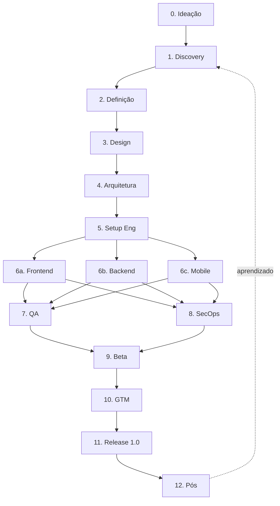

# Pipeline Completo: Da Ideia ao Release 1.0 de um Aplicativo

> Referência profissional do ciclo completo de desenvolvimento de produto digital: fases, sub-fases, caminhos paralelos, entregáveis, papéis humanos e o **agent responsável** em cada etapa. Integrado à constelação de C-levels em [ORG](ORG.md) e à [teoria de liderança C-level](lideranca_pipeline_release.md).

Manuais canônicos aplicáveis: [CONTRACT](manuals/CONTRACT.md) (código), [TESTES](manuals/TESTES.md) (qualidade), [AGILE](manuals/AGILE.md) (cadência), [DEPLOY_CHECKLIST](manuals/DEPLOY_CHECKLIST.md) (deploy), [AUDITORIAS](manuals/AUDITORIAS.md) (checklists).

---

## Visão geral do pipeline

Cada fase tem loops internos (uma descoberta volta ao Discovery, um bug volta ao Dev). O pipeline é **iterativo dentro de cada fase, sequencial entre macro-fases**.

### Mapa fase, C-level e agent

Quem lidera cada fase (detalhe e RACI completo em [ORG](ORG.md) secao 4):

| Fase | C-level (agent) | Agents operacionais |
|---|---|---|
| 0. Ideação | Celso (CEO) | product-manager |
| 1. Discovery | Capitolino (CPO) | product-manager, ux-ui-designer |
| 2. Definição | Capitolino (CPO) | product-manager |
| 3. Design | Capitolino (CPO) | ux-ui-designer, ux-writer, accessibility-specialist |
| 4. Arquitetura | Caetano (CTO) | software-architect, security-engineer |
| 5. Setup Eng | Caetano (CTO) | devops-sre, tech-lead |
| 6. Desenvolvimento | Caetano (CTO) + Cosmo (COO) | frontend/backend/mobile-engineer, devops-sre |
| 7. QA | Caetano (CTO) | qa-engineer, accessibility-specialist |
| 8. Segurança/Compliance | Narciso (CISO) + Cláudio (CLO) | security-engineer, compliance-legal |
| 9. Beta | Capitolino + Caetano | qa-engineer, technical-writer, customer-success, support-engineer |
| 10. GTM | Camilo (CMO) | growth-engineer, content-seo, pr-comms, community-manager |
| 11. Release 1.0 | Celso (CEO) coordena | release-manager, devops-sre, tech-lead, qa-engineer |
| 12. Pós | Capitolino (CPO) | data-scientist, product-manager, customer-success, support-engineer |

Antes de iniciar, **Cósimo (Chief of Staff)** define o porte e a variante de pipeline (secao final). Em projeto pequeno, fases colapsam e a maioria dos agents fica dormente.

Quando IA é capability do produto, **Caio (CAIO)** entra (Fases 2, 4, 6-8, 12) e delega `applied-ai-engineer` (feature LLM: prompt, agente, RAG-app, eval-app, guardrail) e `ml-engineer` (infra/MLOps), em paralelo a Cândido (CDO) no lado do dado. Fronteira: CDO governa o dado, CAIO governa o modelo e o uso de IA. Uma integração de modelo pontual NÃO acorda o CAIO (usa só o `applied-ai-engineer`).

---

## Fase 0: Ideação e Concepção

### 0.1. Identificação do problema
Origem da ideia: dor própria, observação de mercado, job to be done mal resolvido, oportunidade tecnológica (nova API, novo modelo de IA, nova regulamentação). Formulação inicial em uma frase: "Para [usuário], que [contexto/problema], nosso produto é [categoria] que [diferencial chave]."

### 0.2. Hipótese de valor e de crescimento
- **Valor**: usuários vão querer e usar.
- **Crescimento**: existe canal de aquisição economicamente viável.

### 0.3. Validação ultrarrápida (1 a 2 semanas)
Entrevistas exploratórias (5 a 10 pessoas do público-alvo), análise de soluções existentes (busca, app stores, Reddit, fóruns nichados), smoke test (landing page com formulário de interesse + tráfego pago baixo). Decisão **go / no-go / pivot**.

### 0.4. Entregáveis
One-pager da ideia, lista de hipóteses, resumo das entrevistas (3 a 5 insights).

### 0.5. Liderança
Celso (CEO) decide go/no-go. Apoio: Capitolino (CPO) via `product-manager`. Papéis humanos: Founder, PM, UX Researcher, Domain Expert.

---

## Fase 1: Discovery e Estratégia

### 1.1. Pesquisa de usuário
- **Qualitativa**: 8 a 15 entrevistas em profundidade, contextuais quando possível.
- **Quantitativa**: surveys (Typeform, Google Forms), dados públicos.
- **Etnográfica**: observação no ambiente real (clínica, escritório, casa).

### 1.2. Análise competitiva
Matriz de concorrentes (features, preço, UX, posicionamento), SWOT própria, feature gap analysis.

### 1.3. Frameworks estratégicos
Personas (3 a 5 arquétipos), Jobs to Be Done, Value Proposition Canvas (Osterwalder), Business Model Canvas, Lean Canvas (alternativa enxuta).

### 1.4. Mercado e segmentação
TAM / SAM / SOM. Beachhead market (mercado inicial estreito).

### 1.5. Entregáveis
Relatório de Discovery, personas documentadas, BMC + Lean Canvas validados, lista priorizada de problemas.

### 1.6. Liderança
Capitolino (CPO) lidera, via `product-manager` e `ux-ui-designer`. Apoio: Celso (CEO), Camilo (CMO). Papéis humanos: PM, UX Researcher, Business Analyst, Data Analyst.

---

## Fase 2: Definição de Produto

### 2.1. PRD (Product Requirements Document)
1. Contexto e problema. 2. Objetivos (business + user). 3. Personas e cenários. 4. Escopo do MVP (in/out). 5. Requisitos funcionais. 6. Não-funcionais (performance, segurança, acessibilidade, LGPD). 7. Critérios de sucesso e métricas. 8. Riscos e dependências.

### 2.2. Definição do MVP
MoSCoW (Must/Should/Could/Won't), RICE (Reach x Impact x Confidence / Effort), Kano model (delight vs basic).

### 2.3. Métricas (instrumentação desde o dia 1)
North Star Metric, HEART (Happiness, Engagement, Adoption, Retention, Task success), AARRR (Acquisition, Activation, Retention, Referral, Revenue). Cândido (CDO) entra aqui quando dado é ativo central.

### 2.4. Roadmap
Now / Next / Later (em vez de cronograma rígido). Marcos: Alpha, Beta fechado, Beta aberto, GA (1.0).

### 2.5. Entregáveis
PRD aprovado, roadmap, backlog inicial (Linear, Jira, GitHub Projects, ou outro rastreador de issues).

### 2.6. Liderança
Capitolino (CPO) autor, via `product-manager`. Apoio: Caetano (CTO) para viabilidade técnica. Papéis humanos: PM, Tech Lead, UX Lead, stakeholders.

---

## Fase 3: Design (UX + UI)

### 3.1. Arquitetura da informação
Card sorting, tree testing, sitemap, fluxo de navegação.

### 3.2. User flows e jornadas
Diagramas de fluxo (Whimsical, Miro, FigJam), mapa de jornada com pontos de dor e oportunidade.

### 3.3. Wireframes (low-fidelity)
Esboços rápidos, foco em estrutura. Validados em testes não-moderados (Maze, UserTesting).

### 3.4. Mockups (high-fidelity)
Telas finalizadas em Figma, componentização desde o início.

### 3.5. Design system
Tokens (cores, tipografia, espaçamento, sombras, raios), componentes base, documentação (Storybook quando há código), acessibilidade embutida.

### 3.6. Prototipagem interativa
Protótipo clicável no Figma, testes moderados com 5 a 8 usuários por iteração (regra de Nielsen).

### 3.7. Acessibilidade (WCAG 2.2 AA mínimo)
Contraste, navegação por teclado, leitores de tela (NVDA, VoiceOver), alt text, labels semânticos.

### 3.8. Microcopy e UX writing
Tom e voz da marca, mensagens de erro úteis, onboarding copy.

### 3.9. Entregáveis
Design system documentado, telas de todos os fluxos do MVP, protótipo navegável, handoff (Figma Dev Mode, Zeplin).

### 3.10. Liderança
Capitolino (CPO), via `ux-ui-designer`, `ux-writer`, `accessibility-specialist`. Papéis humanos: UX Designer, UI Designer, UX Writer, Design System Engineer, Acessibilidade Specialist.

---

## Fase 4: Arquitetura Técnica

### 4.1. Decisões de stack
Critérios: maturidade, comunidade, hiring, fit com o time, performance, custo de operação. Áreas: frontend web, mobile (nativo vs cross-platform), backend, banco (relacional/NoSQL/busca), cache, filas, storage.

### 4.2. Padrão arquitetural
Monólito modular (recomendado para 1.0 na maioria dos casos), microsserviços (só se justificado por escala ou organização), serverless/edge, event-driven (fluxos assíncronos pesados).

### 4.3. Modelagem de dados
ERD, normalização vs desnormalização consciente, migrations (Flyway, Liquibase, nativas), soft delete e auditoria.

### 4.4. API design
REST com OpenAPI 3.x ou GraphQL, versionamento, erros padronizados (RFC 7807), paginação/filtragem/ordenação, rate limiting.

### 4.5. Segurança by design
OAuth 2.1/OIDC ou sessão server-side, RBAC/ABAC, TLS 1.3 e AES-256-GCM, Argon2id para senha, gestão de segredos (Vault, Secrets Manager, .env nunca no repo), threat modeling STRIDE. Narciso (CISO) entra já aqui.

### 4.6. Infraestrutura
Cloud (AWS/GCP/Azure), VPS ou shared hosting de um provedor à sua escolha. IaC (Terraform, OpenTofu, Pulumi), containers e orquestração só se necessário, CDN.

### 4.7. ADRs (Architecture Decision Records)
Documento curto por decisão: contexto, decisão, consequências, alternativas. Versionado.

### 4.8. Entregáveis
Diagrama C4, ADRs iniciais, spec OpenAPI/GraphQL, ERD, threat model.

### 4.9. Liderança
Caetano (CTO), via `software-architect` (modo colaborativo: opções antes de gravar decisão canônica) e `security-engineer`. Apoio: Narciso (CISO). Papéis humanos: Tech Lead, Solution Architect, Security Engineer, DBA, SRE.

---

## Fase 5: Setup de Engenharia (DevEx Foundation)

### 5.1. Repositório e fluxo
Monorepo (Turborepo, Nx) ou polyrepo, branching (trunk-based, GitHub Flow, GitFlow), Conventional Commits + changelog automatizado.

### 5.2. CI/CD
CI: lint, type-check, testes, build, SAST, análise de licenças. CD: deploy automático para staging no merge, promoção para produção. Ferramentas: GitHub Actions, GitLab CI, Forgejo Actions, Woodpecker, ou outra plataforma de CI.

### 5.3. Ambientes
local, dev, staging, production. Paridade via variáveis de ambiente (12-factor). Staging com dados sintéticos ou anonimizados.

### 5.4. Observabilidade
Logs JSON estruturados (Loki, ELK), métricas (Prometheus + Grafana), tracing (OpenTelemetry), erros (Sentry), uptime (UptimeRobot, Better Stack).

### 5.5. Feature flags
LaunchDarkly, Unleash, ConfigCat ou in-house. Permite dark launch, rollout gradual, kill switch.

### 5.6. Documentação de engenharia
README operacional, ONBOARDING.md, RUNBOOK.md, ARCHITECTURE.md.

### 5.7. Liderança
Caetano (CTO), via `devops-sre` e `tech-lead`. Papéis humanos: DevOps/SRE, Platform Engineer, Tech Lead.

---

## Fase 6: Desenvolvimento (Caminhos Paralelos)

Múltiplas trilhas em paralelo, sincronizadas por Cosmo (COO) via daily standups, sprint planning (Scrum) ou cadências leves (Shape Up, Kanban). Ver [AGILE](manuals/AGILE.md).

### 6a. Frontend Web
Setup: bundler (Vite, esbuild), linter/formatter (ESLint/Biome/Prettier), TypeScript strict. Implementação: componentes do design system, estado (local -> context -> store), roteamento, lazy loading, i18n. Performance: Core Web Vitals (LCP, INP, CLS), Lighthouse CI, bundle analysis. Agent: `frontend-engineer`.

### 6b. Backend / API
Setup: estrutura por domínio (DDD leve) ou camada, middleware (logging, auth, rate limit, CORS, validação). Implementação: endpoints conforme OpenAPI, camada de serviço separada do transporte, repositórios, migrations versionadas, background jobs. Performance: profiling, N+1, índices, cache (Redis), connection pooling. Agent: `backend-engineer`.

### 6c. Mobile (se aplicável)
iOS (Swift + SwiftUI/UIKit, Xcode Cloud/Fastlane), Android (Kotlin + Compose, Gradle/Fastlane), cross-platform (React Native + Expo, Flutter). App Store Connect e Play Console cedo (aprovação leva tempo), TestFlight e Internal Testing. Agent: `mobile-engineer`.

### 6d. DevOps (contínuo)
Provisionamento de produção, backups testados (restore drills), DR plan (RTO e RPO). Agent: `devops-sre`.

### 6e. Liderança
Caetano (CTO) tecnicamente, Cosmo (COO) na execução cross-funcional. Papéis humanos: Frontend, Backend, Mobile, Full-stack, SRE, Tech Lead.

---

## Fase 7: QA e Testes

Pirâmide ou troféu (Kent C. Dodds). Detalhe em [TESTES](manuals/TESTES.md).

### 7.1. Unitários
Funções e classes isoladas (Jest, Vitest, PyTest, JUnit, Catch2). Cobertura é métrica útil, não meta: foque em paths críticos.

### 7.2. Integração
Múltiplos módulos, banco real ou test container, contratos de API (Pact, Schemathesis).

### 7.3. End-to-end
Playwright, Cypress, Selenium. Smoke suite mínima em cada deploy. Cenários críticos (login, fluxo principal, checkout).

### 7.4. Não-funcionais
Performance/carga (k6, JMeter, Locust), acessibilidade (axe-core, Pa11y, Lighthouse), compatibilidade (BrowserStack), visual regression (Chromatic, Percy).

### 7.5. UAT
Stakeholders e usuários reais validam antes do release. Critérios em Given/When/Then.

### 7.6. Bug triage
Severidade (S0 a S4) x prioridade (P0 a P3), SLAs por nível, bug bash antes de marcos.

### 7.7. Liderança
Caetano (CTO), via `qa-engineer` e `accessibility-specialist`. Papéis humanos: QA Engineer, SDET, Performance Engineer, Accessibility Specialist.

---

## Fase 8: Segurança e Compliance

### 8.1. Application Security
SAST (Semgrep, SonarQube, CodeQL), DAST (OWASP ZAP, Burp), SCA (Dependabot, Snyk, Renovate), secrets scanning (Gitleaks, TruffleHog), container scanning (Trivy, Grype).

### 8.2. Pentest
Equipe externa ou interna. Cobertura mínima OWASP Web + API Top 10. Relatório com severidade, PoC, remediação. Re-teste após correção.

### 8.3. Compliance regulatório (Brasil + global)
LGPD (base legal, finalidade, minimização, ROPA, DPIA), GDPR (usuários UE), HIPAA (saúde EUA). Apps médicos no Brasil: Resolução CFM 1.821/2007, 2.314/2022 (telemedicina), retenção de 20 anos do prontuário, ANVISA RDC 657/2022 para SaMD.

### 8.4. Documentos legais
Termos de Uso, Política de Privacidade, aviso de cookies, DPA com subprocessadores.

### 8.5. Resposta a incidentes
Runbook de incidente, plano de comunicação (interno, usuários, ANPD em ate 2 dias úteis em incidente relevante), tabletop exercises.

### 8.6. Liderança
Narciso (CISO) lado técnico via `security-engineer`; Cláudio (CLO) lado jurídico via `compliance-legal`. Papéis humanos: Security Engineer, Pentester, DPO, Legal Counsel, Compliance Officer.

---

## Fase 9: Pré-Lançamento (Alpha para Beta)

### 9.1. Alpha interno (dogfooding)
Time inteiro usa o produto, bug bash semanal, telemetria ativa.

### 9.2. Beta fechado
50 a 500 usuários convidados, NDA opcional, canal direto de feedback (Discord, Slack, formulário), iteração rápida.

### 9.3. Beta aberto / Early Access
Lista de espera em ondas, foco em estabilidade (não em features novas), critérios objetivos de graduation (taxa de bugs, retenção D7/D30, NPS).

### 9.4. Documentação para o usuário
Help center (Intercom Articles, HelpScout, Notion público), vídeos de onboarding, FAQ, changelog público.

### 9.5. Treinamento de suporte e CS
Playbook de atendimento, macros, ferramentas (Zendesk, Intercom, Crisp), SLA. Agents: `customer-success` (onboarding, retenção) e `support-engineer` (atendimento técnico, triagem).

### 9.6. Liderança
Capitolino (CPO) + Caetano (CTO), com Cosmo (COO) na operação, via `qa-engineer`, `technical-writer`, `customer-success`, `support-engineer`, `community-manager`. Papéis humanos: CSM, Support Engineer, Technical Writer, Community Manager.

---

## Fase 10: Go-To-Market (GTM)

Em paralelo com a Fase 9. Liderada por Camilo (CMO).

### 10.1. Posicionamento
Positioning statement claro. April Dunford: contexto competitivo, atributos únicos, valor, quem se importa.

### 10.2. Pricing e packaging
Freemium, free trial, assinatura, pay-per-use, licença perpétua. Pricing page clara, testes A/B. Lente financeira de Confúcio (CFO).

### 10.3. Marketing site / landing
Hero claro, prova social, demo/vídeo/GIF, CTA óbvio, SEO técnico (sitemap, schema.org, Core Web Vitals).

### 10.4. Conteúdo
Blog técnico ou de domínio, lançamento em comunidades (Reddit, HackerNews, Product Hunt, IndieHackers), newsletter pré-lançamento.

### 10.5. PR e parcerias
Press kit, pitch para imprensa, influenciadores e thought leaders da vertical.

### 10.6. ASO (se app)
Título e subtítulo, screenshots e vídeo, descrição com keywords, localização, estratégia de reviews.

### 10.7. Analytics de marketing
GA4 ou Plausible/Fathom, UTM consistente, atribuição multi-touch.

### 10.8. Liderança
Camilo (CMO), via `growth-engineer`, `content-seo`, `pr-comms`, `community-manager`. Receita B2B com Cícero (CRO), pricing com Confúcio (CFO). Papéis humanos: CMO, Content Marketer, Growth Engineer, PR Specialist, Designer de marketing, Community Manager.

---

## Fase 11: Release 1.0 (GA, General Availability)

### 11.1. Release readiness checklist
- [ ] Bugs S0/S1 resolvidos.
- [ ] Crash < 0,5% das sessões.
- [ ] Cobertura em paths críticos > 80%.
- [ ] Pentest passado, P0/P1 fechados.
- [ ] Documentos legais publicados e revisados por advogado.
- [ ] Documentação de usuário completa.
- [ ] Equipe de suporte treinada.
- [ ] Monitoramento e alertas configurados.
- [ ] Runbooks de incidente prontos.
- [ ] Plano de rollback testado.
- [ ] Backups verificados.
- [ ] Capacidade para pico esperado x 3.
- [ ] DR drill nos últimos 90 dias.
- [ ] LGPD ROPA atualizado.

Ver [DEPLOY_CHECKLIST](manuals/DEPLOY_CHECKLIST.md) para as 7 fases de deploy irreversível.

### 11.2. Estratégia de deploy
Blue-green (dois ambientes, switch instantâneo), canary (1% -> 5% -> 25% -> 100% com observação de métricas), feature flags (release técnico desacoplado do release de produto).

### 11.3. War room (dia do lançamento)
Celso (CEO) coordena. Presentes: PM, Tech Lead, SRE on-call, engenheiros de áreas críticas, suporte sênior, comunicação/PR, liderança em standby.

### 11.4. Comunicação coordenada
Press release no horário T, email para lista de espera, post no blog, redes sociais, Product Hunt (terças rendem mais), Show HN, Reddit relevantes.

### 11.5. Observação ativa
Dashboard com taxa de erro, latência p50/p95/p99, throughput, conversão, sign-ups por minuto, custo de infra em tempo real. Alertas em canal dedicado.

### 11.6. Postmortem técnico (D+1 a D+7)
O que foi bem, o que falhou, surpresas, action items. Blameless.

### 11.7. Liderança
Celso (CEO) coordena o war room e dá o go/no-go; Caetano (CTO) e Camilo (CMO) executam; Cosmo (COO) no ritmo. Coordenação operacional via `release-manager`, com `devops-sre`, `tech-lead`, `qa-engineer`, `support-engineer`, `pr-comms`. Papéis humanos: Release Manager, SRE on-call, Tech Lead, PM, Suporte, PR.

---

## Fase 12: Pós-Lançamento

### 12.1. Estabilização (2 a 4 semanas)
Foco em bugs reportados, performance, suporte. Hypercare: equipe atenta, releases pequenas e frequentes.

### 12.2. Análise de métricas
North Star (evolução), funil de ativação (onde travam), coortes de retenção (D1, D7, D30), NPS/CSAT. Cândido (CDO) via `data-scientist`.

### 12.3. Customer feedback loop
Entrevistas com ativos e churned, análise de tickets (categorias comuns), feature requests triados.

### 12.4. Planejamento do 1.1
Revisão do roadmap com dado real, repriorização do backlog, decisão sobre achados de pesquisa contínua.

### 12.5. Otimização contínua
A/B testing incremental, performance budgets revisitados, refinamento de onboarding pelo funil.

### 12.6. Operação madura
Cadência regular (semanal, bi-semanal), sprints de tech debt, auditorias periódicas (segurança trimestral, acessibilidade semestral, ver [AUDITORIAS](manuals/AUDITORIAS.md)).

### 12.7. Liderança
Capitolino (CPO) no roadmap, via `product-manager`, `data-scientist`, `customer-success` (retenção) e `support-engineer` (suporte contínuo). Apoio: Caetano (CTO) estabilidade, Camilo (CMO) crescimento. Papéis humanos: PM, Data Analyst/Scientist, Customer Success, Suporte, Engenheiros, SRE.

---

## Variantes de pipeline por porte (anti over-engineering)

Quem decide e re-avalia: **Cósimo (Chief of Staff)** (agent `cosimo-chief-of-staff`). Critérios na [teoria de liderança C-level](lideranca_pipeline_release.md) secao 5. Detalhe em [ORG](ORG.md) secao 5.

| Variante | Porte | Como o pipeline muda |
|---|---|---|
| **Pipeline-Sprint** | solo / pessoal (1) | Fases 0-2 viram um one-pager; 3 vira wireframe; 4 vira 3 ADRs; 6-8 contínuos; 9-12 enxutos. Só Celso e Caetano ativos. Sem cerimônia. |
| **Pipeline-Lean** | early (2-20) | Fases 0-3 leves mas explícitas (PMF importa). Capitolino, Camilo (light) e Narciso (se dado sensível) entram. Kanban/Shape Up. |
| **Pipeline-Padrão** | scale-up (50-500) | 12 fases completas. Constelação núcleo + Cosmo. Cadência ágil formal. RACI ativo. |
| **Pipeline-Completo** | bigtech (500+) | Constelação inteira (+ Cândido, Caio se IA é capability, Confúcio, Cícero, Cláudio). Multi-produto, cada um com sub-pipeline. |

Criticidade sobrepõe headcount: projeto solo que toca prontuário médico, dinheiro ou PII mantém Narciso (CISO) e Cláudio (CLO) ativos mesmo no Pipeline-Sprint.

---

## Anexo A: Mapa de profissionais e agents

| Área | Papéis humanos | Agents |
|---|---|---|
| Liderança/Produto | CEO, CTO, CPO, PM, Product Owner, Business Analyst | celso-ceo, caetano-cto, capitolino-cpo, product-manager, business-analyst |
| Design | UX Researcher, UX/UI Designer, UX Writer, Design System Eng, Acessibilidade, Motion | ux-researcher, ux-ui-designer, ux-writer, accessibility-specialist, art-director |
| Engenharia | Tech Lead, Frontend, Backend, Mobile, Full-stack, Data Eng, ML Eng, AI Eng (LLM app), DBA, Solution Architect | software-architect, tech-lead, frontend/backend/mobile-engineer, data-engineer, ml-engineer, applied-ai-engineer |
| Plataforma/Op | DevOps, SRE, Platform Eng, Network Eng, Security Eng, Pentester | devops-sre, network-engineer, security-engineer, network-security-engineer |
| Qualidade | QA, SDET, Performance Eng | qa-engineer, performance-engineer |
| Negócio/Suporte | CSM, Support Eng, Community Manager, Technical Writer | customer-success, support-engineer, community-manager, technical-writer |
| Marketing/Growth | CMO, Growth Eng/PM, Content/SEO, PR, Community | camilo-cmo, growth-engineer, content-seo, pr-comms, community-manager |
| Receita/Vendas | CRO, RevOps, Sales | cicero-cro, revenue-ops |
| Legal/Compliance/Auditoria | Legal Counsel, DPO, Compliance Officer, Internal Auditor | claudio-clo, compliance-legal, internal-auditor |
| Gestão | Engineering Manager, Scrum Master, Release Manager | engineering-manager, scrum-master, release-manager |

---

## Anexo B: Stack de ferramentas

| Categoria | Opções |
|---|---|
| Gestão de produto | Linear, Jira, Shortcut, GitHub Projects |
| Documentação | Notion, Confluence, Obsidian, BookStack |
| Design | Figma, Penpot, Sketch |
| Whiteboarding | Miro, FigJam, Excalidraw, tldraw |
| Repositório | GitHub, GitLab, Forgejo, Codeberg |
| CI/CD | GitHub Actions, GitLab CI, Forgejo Actions, Woodpecker |
| Observabilidade | Grafana Stack, Sentry, Datadog, UptimeRobot |
| Comunicação | Slack, Discord, Mattermost, Zulip |
| Suporte | Intercom, HelpScout, Crisp, Plain |
| Analytics | GA4, Plausible, PostHog, Amplitude |
| A/B testing | GrowthBook, PostHog, LaunchDarkly |
| Pentest | Burp Suite, OWASP ZAP, Nuclei, Caido |

---

## Anexo C: Anti-padrões comuns

1. Construir antes de entrevistar usuários.
2. Escopo de MVP virando produto completo (o V é viável, não completo).
3. Adiar segurança e LGPD (retrabalho e multa).
4. Adiar observabilidade (depurar produção sem log estruturado é cego).
5. Não automatizar deploy desde o início (fricção composta).
6. Pular acessibilidade (re-arquitetar a11y depois custa mais).
7. Lançar sem plano de rollback.
8. Marketing sobre produto frágil (queima reputação).
9. Produto sólido sem marketing (não se vende sozinho).
10. Sem ownership claro de incidentes.
11. **Over-engineering**: aplicar pipeline bigtech a projeto solo (combatido por Cósimo).

---

## Anexo D: Cronograma indicativo (produto pequeno, 1 a 5 pessoas)

| Fase | Duração típica |
|---|---|
| 0. Ideação | 2 a 4 semanas |
| 1. Discovery | 3 a 6 semanas |
| 2. Definição | 2 a 3 semanas |
| 3. Design | 4 a 8 semanas (sobrepõe 4 e 5) |
| 4. Arquitetura | 2 a 4 semanas |
| 5. Setup | 1 a 2 semanas |
| 6. Desenvolvimento | 3 a 9 meses |
| 7. QA / 8. Sec | contínuos durante 6, intensifica no fim |
| 9. Beta | 1 a 3 meses |
| 10. GTM prep | 1 a 2 meses (paralelo a 9) |
| 11. Release 1.0 | evento de 1 dia + 1 semana hypercare |
| 12. Pós | contínuo |

**Total típico para SaaS pequeno: 6 a 14 meses** da ideia ao 1.0. No Pipeline-Sprint (solo), pode cair para semanas.

---

## Links

- [ORG](ORG.md) (constelação, RACI, pendências) · [teoria de liderança C-level](lideranca_pipeline_release.md)
- [CONTRACT](manuals/CONTRACT.md) · [TESTES](manuals/TESTES.md) · [AGILE](manuals/AGILE.md) · [DEPLOY_CHECKLIST](manuals/DEPLOY_CHECKLIST.md) · [AUDITORIAS](manuals/AUDITORIAS.md)
- O `CLAUDE.md` e o `TODO.md` na raiz do seu projeto definem, respectivamente, as preferências e a fila de pendências locais.
